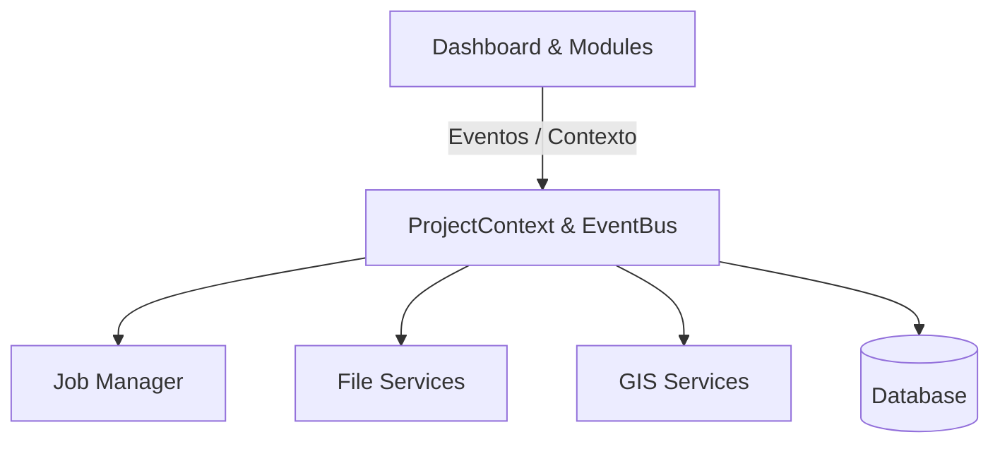

# GEOGIS Suite - Arquitetura (Project-Centric)

## Visão Geral
O GEOGIS Suite é uma plataforma corporativa modular voltada para Engenharia, Geoprocessamento e Regularização Fundiária. 
Nenhuma funcionalidade de negócio será implementada de forma isolada; tudo gira em torno de um **Projeto**.

### Paradigma: Project-Centric
O **Projeto** é a entidade central. O `ProjectContext` é distribuído para todos os módulos.

## Componentes Core
1. **File Manager**: (`services/files/`)
2. **GIS Services**: (`services/gis/`)
3. **Job Manager**: (`core/jobs/`)
4. **Notification Center**
5. **Search Engine**
6. **Workflow Engine**

## Diagrama Principal

