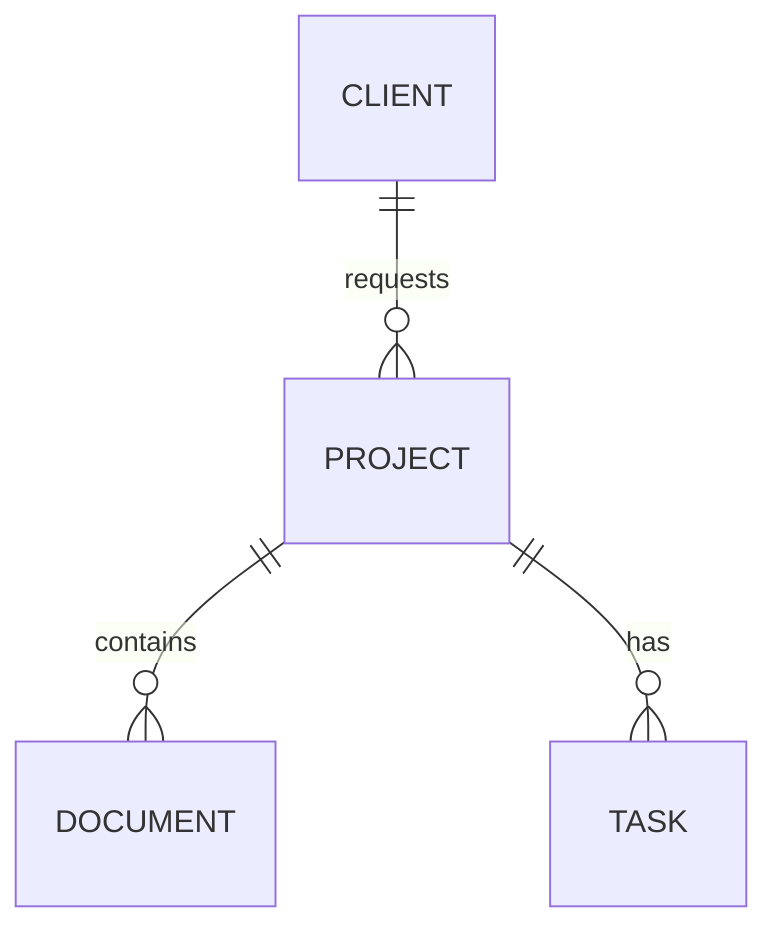

# Documentação do Banco de Dados

Utilizamos SQLAlchemy com `alembic` para migrações. O banco inicia em SQLite.

## Tabelas Principais
- **Users**: Usuários e roles.
- **Projects**: Core do sistema.
- **Clients**: Vinculados a projetos.
- **Files / Documents**: Metadados de arquivos.
- **Tasks / Workflows**: Gestão de etapas.
- **Notifications**: Notificações persistidas.
- **RecentFiles**: Arquivos recentes.

## Diagrama ER

