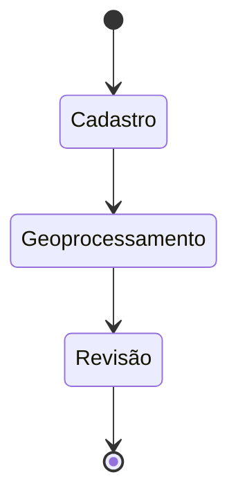

# Workflow Engine

O sistema gerencia fluxos de trabalho associados a cada projeto.

## Estrutura
Um `Workflow` possui várias `Tasks`. 
Exemplo: Cadastro -> Geo -> Comparativos -> Ambiental -> Revisão.

## Exemplo de Uso
```python
workflow_service = WorkflowService()
workflow_service.start_workflow(project_context.id, "REGULARIZACAO")
```


