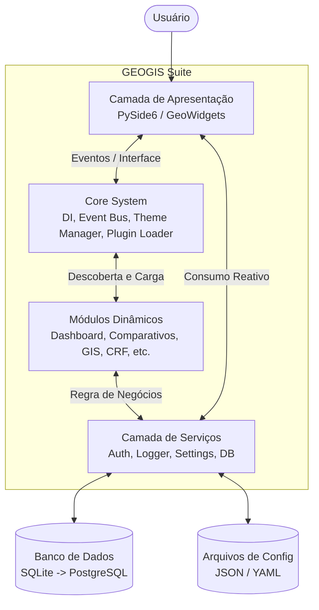
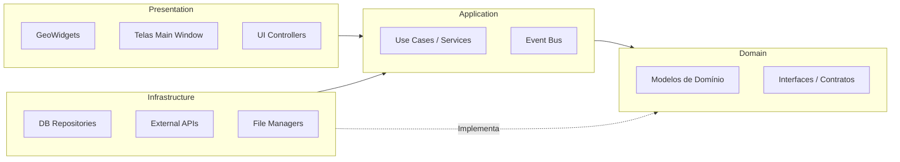

# GEOGIS Suite - Documento de Arquitetura

Fornecerei este documento como `ARCHITECTURE.md` na raiz do projeto assim que for aprovado.

## 1. Visão Geral do Sistema
O **GEOGIS Suite** é uma plataforma corporativa modular voltada para Engenharia, Geoprocessamento e Regularização Fundiária. O sistema centraliza diversas ferramentas independentes em uma interface unificada, inspirada em IDEs e plataformas modernas (como JetBrains, Notion, ArcGIS Pro e GitHub Desktop). A filosofia central é a **modularidade extrema**: nenhum módulo funcional tem dependência direta de outro, e todas as comunicações ocorrem através de uma camada de serviços e eventos.

## 2. Padrões de Projeto Utilizados
O sistema foi desenhado com foco em escalabilidade e manutenção a longo prazo, empregando os seguintes padrões:
- **Clean Architecture**: Separação clara entre Apresentação (UI), Aplicação, Domínio e Infraestrutura.
- **Service Layer**: Toda lógica de negócios, acesso a dados e orquestração passa por serviços centrais desacoplados.
- **Repository Pattern**: Abstração da camada de banco de dados usando SQLAlchemy. Isso garante que a futura migração de SQLite para PostgreSQL/PostGIS ocorra sem impactos na lógica de negócio.
- **Dependency Injection (DI)**: Injeção de dependências para gerenciar instâncias de serviços e facilitar testes.
- **Event Bus (Pub/Sub)**: Comunicação reativa entre módulos. O estado e as ações fluem de maneira indireta (um módulo publica um evento, outros reagem).
- **Plugin Loader**: Módulos são tratados como plugins dinâmicos. A adição de um novo recurso requer apenas a inclusão de uma nova pasta no diretório correspondente.
- **MVVM / MVC (PySide6)**: Separação estrita entre regras visuais e lógica de operação, nunca misturando regra de negócio com UI.

## 3. Diagramas de Arquitetura

### 3.1. Arquitetura de Alto Nível (C4 - Contexto & Container)


### 3.2. Estrutura Clean Architecture


## 4. Estrutura de Diretórios
A estrutura do projeto garantirá isolamento de responsabilidades e será base para a expansão futura.

```text
geogis-suite/
│
├── src/
│   ├── core/                   # Núcleo estrutural do sistema
│   │   ├── events.py           # Sistema de Event Bus (Pub/Sub)
│   │   ├── di.py               # Dependency Injection Container
│   │   ├── plugin_loader.py    # Carregador e validador de módulos
│   │   └── exceptions.py       # Tratamento global de erros
│   │
│   ├── services/               # Serviços compartilhados de aplicação
│   │   ├── config_service.py   # Gerenciamento de arquivos JSON/YAML
│   │   ├── log_service.py      # Integração e formatação via Loguru
│   │   ├── auth_service.py     # Autenticação e permissões
│   │   └── theme_service.py    # Theme Manager (Variáveis e paletas)
│   │
│   ├── database/               # Camada de Dados (Infraestrutura)
│   │   ├── connection.py       # Configuração do SQLAlchemy
│   │   ├── models/             # Entidades/Tabelas declarativas
│   │   └── repositories/       # Padrão Repository para abstração
│   │
│   ├── ui/                     # Interface de Usuário (PySide6)
│   │   ├── main_window.py      # Contêiner Principal (Single-Window)
│   │   ├── controllers/        # Orquestradores visuais
│   │   └── widgets/            # Biblioteca UI Premium (GeoWidgets)
│   │       ├── geo_button.py
│   │       ├── geo_card.py
│   │       ├── geo_input.py
│   │       ├── geo_sidebar.py
│   │       └── geo_table.py
│   │
│   ├── modules/                # Ferramentas e Regras de Negócio
│   │   ├── dashboard/          # Tela inicial (projetos, atividades, uso)
│   │   └── (outros)            # Módulos carregados via Plugin Loader
│   │
│   ├── assets/                 # Recursos visuais estáticos (ícones, imagens)
│   ├── themes/                 # Definições QSS limpas baseadas em variáveis
│   └── config/                 # Configurações padrão e templates
│
├── logs/                       # Armazenamento local de arquivos de log
├── tests/                      # Suite de testes unitários e de integração
├── docs/                       # Documentações técnicas auxiliares
├── .env.example                # Variáveis de ambiente de exemplo
├── requirements.txt            # Gestão de dependências Python
└── main.py                     # Entry point da aplicação
```

## 5. Fluxo de Dados e Comunicação

### Carregamento Dinâmico de Módulos (Plugins)
1. Durante a inicialização (`main.py`), o **Core** carrega Banco de Dados, Logs, Configurações, Theme Manager e Event Bus.
2. A janela principal (`MainWindow`) é renderizada vazia, com a casca da plataforma (Sidebar lateral flutuante, Navbar superior, central de notificações e Status Bar).
3. O `PluginLoader` percorre o diretório `src/modules/`, validando assinaturas e inicializando apenas os módulos ativos.
4. O próprio carregador adiciona dinamicamente as rotas na Sidebar.
5. Todo clique de navegação apenas troca o componente central, sem nunca instanciar novas janelas soltas.

### Event Bus (Comunicação Assíncrona e Desacoplada)
Para garantir que um módulo não dependa do código de outro, usamos um barramento de eventos:
- Exemplo: O módulo de "Projetos" cria um novo projeto.
- Ele emite: `event_bus.publish("PROJECT_CREATED", data={"id": 12, "name": "Residencial A"})`
- A interface de "Notificações" (`GeoNotification`), que está assinando globalmente eventos do sistema, intercepta isso e lança um *toast popup*.
- O módulo de "Dashboard" também intercepta e atualiza seu contador de atividades recentes na tela.

### Theme Manager e Identidade Visual (Premium & Fluida)
- O QSS (Qt Style Sheets) nunca conterá cores hexadecimais fixas (ex: `#FF0000`).
- Todas as propriedades visuais serão mapeadas em variáveis de paleta (`@primary-color`, `@bg-dark`, `@text-muted`).
- Os `GeoWidgets` aplicarão micro-interações (hover dinâmico, animações suaves, foco) para criar uma sensação *premium* e corporativa.

## 6. Roadmap de Desenvolvimento

### Fase 1: Fundação & Core (Escopo Atual)
**Objetivo: Desenvolver o alicerce do sistema (Sem nenhuma regra de negócio).**
- Configuração do ambiente virtual, dependências principais e estrutura de diretórios.
- Implementação de **Serviços Base**: Loguru, Configurações (JSON/YAML) e Banco de Dados preparatório.
- Desenvolvimento do **Core**: Event Bus, Dependency Injection Container e Plugin Loader.
- Criação do **Theme Manager** com paleta de cores corporativa dinâmica e moderna.
- Desenvolvimento da biblioteca reutilizável de **GeoWidgets** baseada no tema.
- Criação da **Main Window** fluida (Navegação em aba central/Stack, sem múltiplas janelas).
- Desenvolvimento do **Dashboard (Mockup Funcional)** focado no design de componentes vazios e leitura de recursos do sistema.

### Fase 2: MVP de Módulos Iniciais
- Desenvolvimento e orquestração do Módulo de Gerenciamento de Projetos.
- Conversão e integração dos primeiros scripts para o novo formato de Módulo (Ex: Editor de PDFs / Comparativos).
- Refino de banco de dados local com SQLite.
- Implementação do Sistema Básico de Permissões (Roles e Usuários Locais).

### Fase 3: Versão Beta e Geoprocessamento
- Adição do Módulo GIS e de visualização de mapas.
- Integração com CRF, Cotações e módulo Ambiental.
- Finalização de relatórios genéricos e exportação de documentos.

### Fase 4: Produção 1.0 e Escalabilidade
- Homologação e transição via arquivo de config para PostgreSQL + PostGIS.
- Integração entre os diversos módulos (projetos puxando dados do GIS e CRF).
- Lançamento para uso em larga escala da plataforma consolidada.

## User Review Required
> [!IMPORTANT]
> **Aprovação da Arquitetura**: Verifique se a estrutura, o fluxo e o modelo propostos estão alinhados com sua visão para a plataforma. Ao clicar em **Proceed / Aprovar**, avançarei com a criação dos arquivos desta estrutura inicial, criação do `ARCHITECTURE.md` na raiz do projeto e configuração do ambiente para iniciar a **Fase 1** (Fundação).
